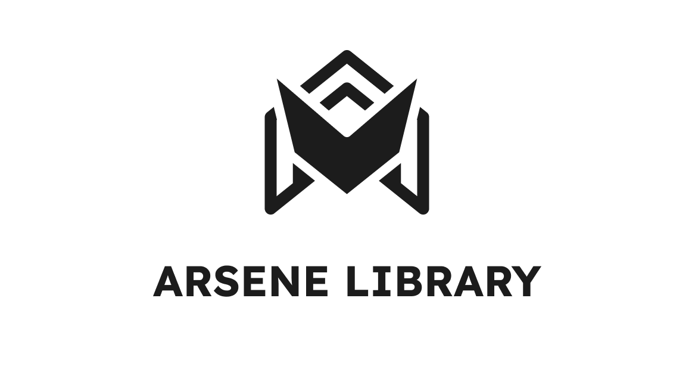

# Arsene Library - Laravel Framework

## Overview

Welcome to the enchanting world of Arsene Library, where the boundless realms of knowledge converge to embrace students and educators in an embrace of wisdom's grace. Here, amidst the hallowed digital shelves, a treasury of educational materials and textbooks await, a symphony of resources that shall serenade the curious minds in their pursuit of enlightenment.

## Features

- Explore a vast collection of digital books and academic materials tailored for school use.
- Streamline the borrowing and return processes with an intuitive user interface.
- Search, categorize, and manage your digital library efficiently.
- Enhance the learning experience with advanced features like book reservations and recommendations.

## Getting Started

To get started with this project, follow these steps:

1. Clone the repository: `git clone https://github.com/yourusername/school-library.git`
2. Install project dependencies: `composer install`
3. Create a copy of the `.env` file: `cp .env.example .env`
4. Generate an application key: `php artisan key:generate`

## Usage

Welcome to Arsene Library, your gateway to a comprehensive online library designed for students and educators. This platform provides easy access to a wealth of educational materials, including books, enabling you to search, view details, and borrow them online.

## Technologies Used

This project is built using the following technologies:

- Laravel
- PHP
- JavaScript
- jQuery
- AJAX

## Contributing

Currently, this project is a personal endeavor. Contributions are not open to the public at the moment.

## License

This project is licensed under the MIT License. See the LICENSE file for details.

## Contact

For questions or further information, feel free to contact me on Instagram: [@mhd.pashaa](https://www.instagram.com/mhd.pashaa/).

## Acknowledgments

We'd like to express our gratitude to [Creative Tim](https://www.creative-tim.com/product/soft-ui-dashboard) for the Soft UI design that inspired the look and feel of this project.
